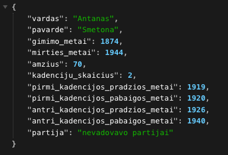

# LT-Presidents-API
Fetch a random president of Lithuania and their information.
Uses FastAPI, json and random libraries.

### How to run
Fork repository, inside the directory run `python3 -m uvicorn main:app --reload`. Visit `localhost:8000` and each time you reload, you will fetch a random president. Returned in a JSON format.

